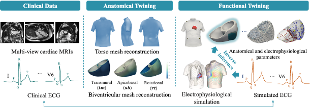

# MI inverse inference
Code for the inverse inference of infarcted area from ECG and MRI for myocardial infarction (MI) patients. This is achieved within a cardiac digital twin (CDT) framework, where the anatomical twinning personalizes the geometrical model, while functional twinning personalizes the electrophysiological model.




## Notes:<a id="Summary"/>
1. *Cardiac_Personalisation-SenAnalysis* fold only contain partial code for the ECG simulation and the sensitivity analysis. For the full Eikonal-based ECG simulation code, please contact [Dr Julia Camps](mailto:julia.camps@cs.ox.ac.uk).
2. *Cobiveco* fold only contrain partial code converting biventicle mesh into cobiveco mesh. For the complete Cobiveco mesh reconstruction code, please visit [KIT-IBE Cobiveco Github repository](https://github.com/KIT-IBT/Cobiveco), which is achieved based on Matlab.

## Package dependencies:<a id="Package dependencies"/>
This repository is based on PyTorch, running on a computer with 3.50~GHz Intel(R) Xeon(R) E-2146G CPU and an NVIDIA GeForce RTX 3060.

## Dataset:<a id="Dataset"/>
Our network is trained based on UKB dataset, which contains paired multi-view MRIs and ECG data. We have reconstruced the cardiac geometry from the multi-view MRIs and converted it into cobiveco mesh. The scar/border zone area were assigned on the mesh and subsequently used for ECG simulation of MI patients.

The data folder should be like:
```
tree
`-- UKB_clinical_data
    `-- patientID
    |    |-- patientID_cobiveco_AHA17.vtu
    |    |-- patientID_heart_cobiveco.vtu
    |    |-- patientID_simulated_ECG_xxx_subendo.csv
    |    |-- patientID_simulated_ECG_xxx_transmural.csv
    |    |-- ...
    |    |-- patientID_electrodePosition.csv
		
```

## Citation:<a id="Citation"/>
If you find this code useful in your research, please consider citing:
```
@article{jounral/TMI/li2024,
  title={Towards Enabling Cardiac Digital Twins of Myocardial Infarction Using Deep Computational Models for Inverse Inference},
  author={Li, Lei and Camps, Julia and Wang, Zhinuo and Banerjee, Abhirup and Rodriguez, Blanca and Grau, Vicente},
  journal={IEEE Transactions on Medical Imaging},
  year={2024}
}

```
